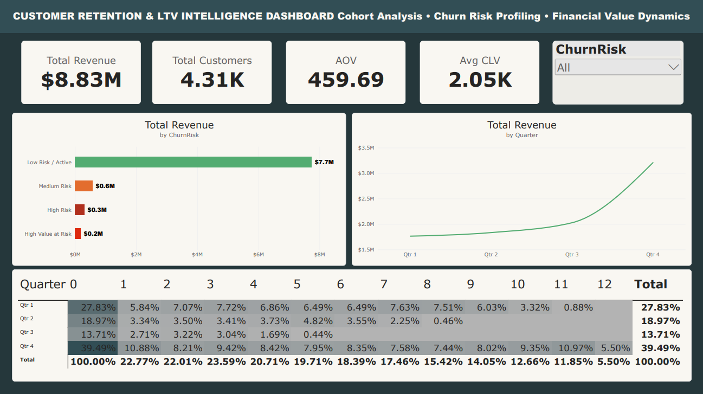

# 🎯 Customer Retention & LTV Intelligence

An end-to-end analytics project combining Python, SQL, and Power BI to identify customer churn risk, quantify lifetime value, segment customers into actionable business categories, and surface top-performing products across a two-year e-commerce dataset.

## 🛠️ Tech Stack
- **Data Cleaning & Segmentation:** Python (Pandas, NumPy)
- **Database & Analytics:** SQLite (CTEs, Window Logic, Aggregations)
- **Visualization:** Power BI (DAX, connected live via the SQLite ODBC Driver)
- **Environment:** JupyterLab

---

## 🔄 Pipeline Workflow

### 1. Data Ingestion
Downloaded the UCI Online Retail II dataset (Dec 2009 – Dec 2011) — a two-year span chosen specifically to support multi-month cohort tracking, which a single-year dataset cannot provide.

### 2. Data Cleaning & Churn Risk Scoring (Python)
- Removed cancelled invoices, invalid quantities/prices, and rows missing a Customer ID.
- Removed rows with missing product descriptions to keep product-level analysis clean.
- Excluded non-product administrative codes (e.g. manual charges, postage fees) from any product-level analysis, so they don't distort rankings of actual merchandise.
- Calculated Recency, Frequency, and Monetary (RFM) value per customer.
- Classified each customer into a churn risk segment using a Monetary-aware, threshold-based rule (rather than relative quartile scoring), so the label stays directly interpretable for a retention use case:
  - **High Value at Risk** — inactive 180+ days AND $2,000+ lifetime spend
  - **High Risk** — inactive 180+ days (below the spend threshold)
  - **Medium Risk** — inactive 90–180 days
  - **Low Risk / Active** — purchased within the last 90 days
- Added a second, business-facing segmentation layer (**ClientSegment**) alongside the churn-risk model, classifying every customer as **VIP**, **At Risk**, **New Customer**, or **Active** — plus a mapped **RecommendedAction** per segment, turning the analysis into a direct, actionable output rather than a label alone.

### 3. Product Analysis (Python)
- Aggregated transaction-level data to the product level to identify the top 10 most profitable products (by revenue) and the top 10 best-selling products (by quantity) — two different questions that don't always point to the same items.

### 4. SQL Analytics
- Exported cleaned transactions and RFM/churn/segment scores into SQLite.
- Built a **Cohort Retention Matrix**: tracks what percentage of each monthly cohort is still active in months 0, 1, 2, 3, 6, and 12 after their first purchase.
- Calculated **Customer Lifetime Value (CLV)** and average purchase behavior per churn risk segment, and a parallel summary by the business-facing **ClientSegment** labels.
- Queries were executed and validated directly inside the notebook before being saved to a standalone `.sql` file, ensuring the file matches exactly what was verified.

### 5. Power BI Dashboard
Connected live to the SQLite database via the SQLite3 ODBC Driver, across three pages:
- **Cohort Analysis:** KPI cards (Total Revenue, Total Customers, AOV, Average CLV), revenue by churn risk segment, quarterly revenue trend, and the full cohort retention matrix.
- **Client Segments:** customer distribution across VIP / Active / New / At Risk, total revenue by segment, and a searchable per-customer table showing each customer's segment, total spend, and recommended action.
- **Top Products:** side-by-side rankings of the most profitable products and the best-selling products by quantity.

---

## 📈 Key Insights

**Overall metrics:** $8.83M total revenue across 4,312 customers, with an average order value of $459.69 and average CLV of $2.05K.

### 🎯 High-Value Churn Risk Segment
Moving beyond a standard Recency/Frequency-only churn rule surfaced a small but critical sub-segment: **High Value at Risk**.

- **Target audience:** 29 unique customers (~0.67% of the total customer base)
- **Revenue at risk:** $192,374.25 of historical revenue
- **Why it matters:** despite being a tiny fraction of the customer base, this segment's average lifetime value (~$6,633.59) is dramatically higher than the overall average CLV ($2.05K) — losing them permanently has an outsized impact on long-term revenue, far beyond what their headcount suggests.
- **Retention implication:** rather than spreading a retention budget evenly across the full "High Risk" cohort (796 customers), this segmentation lets retention efforts prioritize these 29 high-value accounts specifically, with personalized outreach and loyalty incentives.

### 👥 Business-Facing Client Segments
Reframing the same RFM foundation into VIP / Active / New / At Risk labels shows just how concentrated value is: **VIP customers make up only 22% of the customer base but generate roughly 75% of total revenue** ($6.65M), each with a specific recommended action (exclusive loyalty offers and direct outreach for VIPs, win-back discounts for At Risk customers, welcome offers for New Customers, and cross-sell recommendations for Active customers).

### 🛒 Top Products
Separating "most profitable" from "best-selling by volume" surfaces products that wouldn't stand out from revenue alone — for example, some high-quantity items sell in bulk to very few customers, which changes how they should be marketed compared to broadly popular items.

### 📊 Cohort Retention
The retention matrix shows a consistent drop-off pattern across cohorts, with a notable share of each monthly cohort still active at the 6- and 12-month marks — a baseline that can be tracked over time to measure whether retention initiatives are working.

**Data limitation:** later cohorts (e.g. customers acquired from mid-2010 onward) show zero or missing values at longer month indices (6, 12) simply because the dataset ends in December 2011 — those customers have not yet had the chance to reach that milestone within the observation window. This is a right-censoring effect inherent to any fixed-period dataset, not a data quality issue.

## 📁 Files
- `01_Customer_Retention_Data_Cleaning.ipynb` — data ingestion, cleaning, RFM/churn/segment scoring, product analysis, and SQL export (queries executed and validated in-notebook).
- `02_SQL_Cohort_Retention_Analysis.sql` — standalone cohort retention, CLV, and client segment summary query file.
- Power BI dashboard export (see repository).

## 📊 Data Source
UCI Machine Learning Repository — Online Retail II dataset (raw data not included in this repository due to size; downloaded automatically by the cleaning notebook).

---

*Sample data sourced from a public dataset for portfolio demonstration purposes.*
